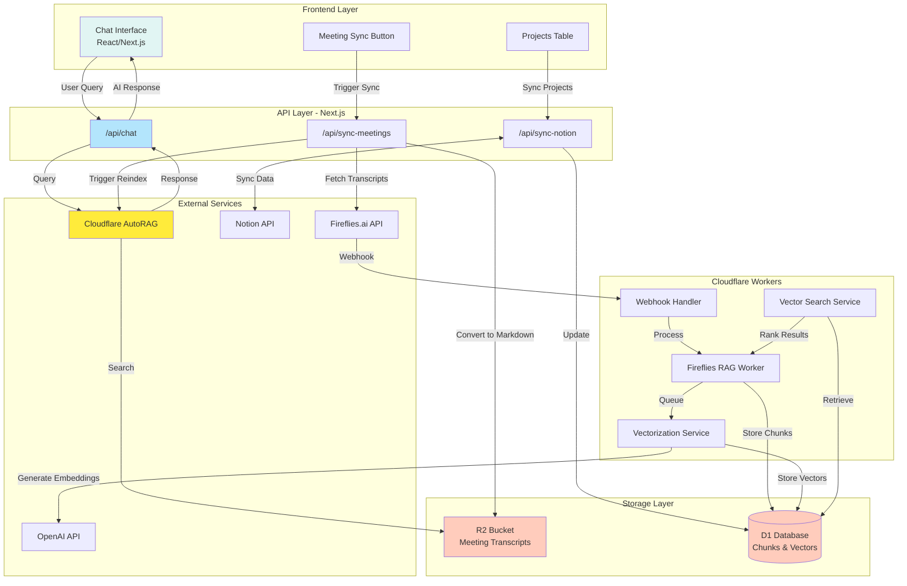

# RAG System Architecture Documentation

## Overview
The Alleato AI RAG (Retrieval-Augmented Generation) system is a sophisticated business intelligence platform that combines meeting transcript analysis with document search capabilities to provide AI-powered insights.

## Architecture Diagram



## Component Details

### 1. Frontend Layer
- **Chat Interface**: React component providing conversational UI
- **Meeting Sync**: Manual trigger for Fireflies transcript sync
- **Projects Table**: Notion integration for project management

### 2. API Layer
- **Chat API**: Processes user queries through Cloudflare AutoRAG
- **Sync Meetings API**: Fetches and processes Fireflies transcripts
- **Notion Sync API**: Bidirectional sync with Notion databases

### 3. Cloudflare Workers
- **Main Worker**: Orchestrates the RAG pipeline
- **Webhook Handler**: Receives real-time meeting notifications
- **Vectorization Service**: Generates embeddings using OpenAI
- **Search Service**: Performs vector similarity search

### 4. Storage Layer
- **R2 Bucket**: Stores markdown-formatted meeting transcripts
- **D1 Database**: Stores chunked content, embeddings, and metadata

## Data Flow Patterns

### Query Flow (User → Response)
1. User enters query in chat interface
2. Frontend sends POST request to `/api/chat`
3. API forwards query to Cloudflare AutoRAG
4. AutoRAG searches indexed content in R2
5. AI generates contextual response
6. Response displayed in chat interface

### Ingestion Flow (Meeting → Index)
1. Meeting completed in Fireflies
2. Webhook triggers worker processing
3. Worker fetches full transcript
4. Content chunked using multiple strategies:
   - Full transcript (complete context)
   - Time-based (5-min segments)
   - Speaker turns (conversation flow)
5. Chunks stored in D1 database
6. Vectorization service generates embeddings
7. Vectors stored for similarity search

### Search Flow (Query → Results)
1. Query embedding generated
2. Vector similarity search in D1
3. Text search for keyword matching
4. Results ranked by relevance
5. Context enrichment from surrounding chunks
6. Formatted results returned

## Key Features

### Current Capabilities
- ✅ Real-time meeting transcript ingestion
- ✅ Multi-strategy content chunking
- ✅ Semantic search with embeddings
- ✅ AI-powered response generation
- ✅ Notion integration for projects
- ✅ Basic metadata extraction

### Limitations
- ❌ No action item detection
- ❌ Limited cross-meeting analytics
- ❌ No sentiment analysis
- ❌ Basic participant identification
- ❌ No trend analysis
- ❌ Manual sync required for updates

## Improvement Opportunities

### 1. Enhanced Metadata Extraction
```typescript
interface EnhancedMetadata {
  actionItems: ActionItem[];
  decisions: Decision[];
  participants: Participant[];
  sentiment: SentimentScore;
  topics: Topic[];
  projectPhase: string;
  urgency: UrgencyLevel;
}
```

### 2. Smart Search Features
- Query expansion with synonyms
- Faceted search with dynamic filters
- Time-range based queries
- Cross-meeting correlation
- Conversational context retention

### 3. Business Intelligence Layer
- Meeting frequency analytics
- Participant engagement metrics
- Project health dashboards
- Action item tracking
- Automated follow-up reminders

### 4. Technical Optimizations
- Migrate to Cloudflare Vectorize
- Implement result caching
- Add parallel processing
- Enhance error handling
- Add comprehensive monitoring

## Environment Configuration

### Required Environment Variables
```env
# Cloudflare
CLOUDFLARE_ACCOUNT_ID=your_account_id
CLOUDFLARE_API_TOKEN=your_api_token

# External Services
FIREFLIES_API_KEY=your_fireflies_key
OPENAI_API_KEY=your_openai_key

# Storage
R2_BUCKET_NAME=meeting-transcripts

# Notion Integration
NOTION_API_KEY=your_notion_key
NOTION_DATABASE_ID=your_database_id
```

### Worker Configuration (wrangler.jsonc)
```json
{
  "name": "fireflies-rag-worker",
  "main": "src/index.js",
  "compatibility_date": "2025-03-07",
  "node_compat": true,
  "d1_databases": [
    {
      "binding": "ALLEATO_DB",
      "database_name": "alleato-ai",
      "database_id": "your_database_id"
    }
  ],
  "r2_buckets": [
    {
      "binding": "MEETING_TRANSCRIPTS",
      "bucket_name": "meeting-transcripts"
    }
  ],
  "triggers": {
    "crons": ["0 */6 * * *"]
  }
}
```

## Security Considerations
- API keys stored as environment variables
- CORS configuration for API endpoints
- Rate limiting on vector generation
- Secure webhook validation
- Access control for sensitive data

## Monitoring and Observability
- Worker execution logs
- API response times
- Vector generation metrics
- Search performance stats
- Error tracking and alerts

## Future Roadmap
1. **Phase 1**: Implement smart metadata extraction
2. **Phase 2**: Add business intelligence dashboards
3. **Phase 3**: Enable real-time collaboration features
4. **Phase 4**: Integrate with project management tools
5. **Phase 5**: Add predictive analytics capabilities