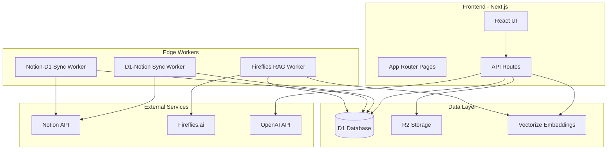

# Alleato AI - Architecture Overview

## System Architecture

Alleato AI is built as a modern, serverless application leveraging Cloudflare's edge computing platform for optimal performance and scalability.



## Components Overview

### Frontend Layer

#### Next.js Application
- **Framework**: Next.js 14 with App Router
- **UI Library**: React 18 with TypeScript
- **Styling**: Tailwind CSS with custom design system
- **Component Library**: Radix UI primitives with shadcn/ui

#### Key Frontend Modules

1. **Authentication System** (`/src/app/(auth)`)
   - Sign-in/Sign-up pages
   - Session management
   - Protected route handling

2. **Dashboard Module** (`/src/app/dashboard`)
   - Real-time analytics widgets
   - KPI tracking
   - Visual data representations

3. **AI Chat Interface** (`/src/app/chat`)
   - WebSocket-based real-time messaging
   - Context-aware responses
   - Conversation history

4. **Data Management** (`/src/app/tables`)
   - Projects table with CRUD operations
   - Clients management interface
   - Document library

### Backend Layer

#### API Routes (`/src/app/api`)

1. **Chat API** (`/chat`)
   - Handles AI conversation requests
   - Implements RAG pipeline
   - Manages conversation context

2. **Sync APIs**
   - `/sync-notion`: Manual Notion sync trigger
   - `/sync-d1-notion`: D1 to Notion sync
   - `/sync-notion-to-d1`: Notion to D1 sync
   - `/sync-meetings`: Fireflies transcript sync

3. **Data APIs**
   - `/clients`: Client CRUD operations
   - `/documents`: Document management
   - `/user`: User profile management

#### Cloudflare Workers

1. **D1-Notion Sync Worker**
   - Scheduled sync every 6 hours
   - Handles D1 → Notion data flow
   - Manages conflict resolution

2. **Notion-D1 Sync Worker**
   - Scheduled sync every 4 hours
   - Handles Notion → D1 data flow
   - Maintains data consistency

3. **Fireflies RAG Worker**
   - Processes meeting transcripts
   - Generates embeddings
   - Stores in Vectorize for search

### Data Layer

#### D1 Database Schema

```sql
-- Core Tables
projects (
  id INTEGER PRIMARY KEY,
  title TEXT,
  project_address TEXT,
  estimated_value REAL,
  profit_margin REAL,
  status TEXT,
  notion_id TEXT UNIQUE,
  created_at TIMESTAMP,
  updated_at TIMESTAMP
)

clients (
  id INTEGER PRIMARY KEY,
  company TEXT,
  contact_name TEXT,
  email TEXT,
  phone TEXT,
  address TEXT,
  type TEXT,
  notion_id TEXT UNIQUE,
  created_at TIMESTAMP
)

documents (
  id TEXT PRIMARY KEY,
  name TEXT,
  type TEXT,
  url TEXT,
  size INTEGER,
  project_id TEXT,
  created_at TIMESTAMP
)

meetings (
  id TEXT PRIMARY KEY,
  title TEXT,
  date TIMESTAMP,
  participants TEXT,
  transcript_url TEXT,
  summary TEXT,
  created_at TIMESTAMP
)
```

#### R2 Storage Structure

```
/documents
  /projects
    /{project-id}/
      /contracts/
      /plans/
      /reports/
  /meetings
    /{year}/{month}/
      /{meeting-id}.transcript
  /uploads
    /temp/
    /processed/
```

#### Vectorize Configuration

- **Index**: `alleato-embeddings`
- **Dimensions**: 1536 (OpenAI ada-002)
- **Metric**: Cosine similarity
- **Namespaces**: 
  - `documents`: Document embeddings
  - `meetings`: Meeting transcript chunks
  - `projects`: Project descriptions

## Data Flow Patterns

### 1. Document Upload Flow
```
User Upload → API Route → R2 Storage → Metadata to D1 → Generate Embedding → Store in Vectorize
```

### 2. Notion Sync Flow
```
Cron Trigger → Worker Activation → Fetch Notion Data → Transform → Upsert to D1 → Update Sync Log
```

### 3. AI Chat Query Flow
```
User Query → API Route → Generate Query Embedding → Vector Search → Retrieve Context → OpenAI API → Stream Response
```

### 4. Meeting Processing Flow
```
Fireflies Webhook → RAG Worker → Fetch Transcript → Chunk Text → Generate Embeddings → Store in Vectorize → Update D1
```

## Security Architecture

### Authentication & Authorization
- JWT-based session management
- Role-based access control (RBAC)
- API key validation for external services

### Data Security
- All data encrypted at rest in D1 and R2
- TLS encryption for all API communications
- Environment-based secret management

### API Security
- Rate limiting on all endpoints
- CORS configuration for frontend origins
- Request validation and sanitization

## Performance Optimizations

### Frontend
- React Server Components for initial load
- Suspense boundaries for async data
- Image optimization with Next.js Image
- Code splitting at route level

### Backend
- Edge computing with Cloudflare Workers
- Cached responses for frequent queries
- Batch operations for sync processes
- Connection pooling for database queries

### Data Layer
- Indexed queries on D1
- Vectorize for fast semantic search
- R2 with CDN for static assets
- Incremental sync strategies

## Monitoring & Observability

### Application Monitoring
- Error tracking with Sentry integration
- Performance monitoring via Web Vitals
- Custom metrics for business KPIs

### Infrastructure Monitoring
- Cloudflare Analytics for Workers
- D1 query performance metrics
- R2 bandwidth and storage usage

### Logging Strategy
- Structured JSON logging
- Log aggregation in Cloudflare Logs
- Debug logs in development only

## Deployment Architecture

### Development Environment
- Local Next.js dev server
- Miniflare for Workers emulation
- Local SQLite for D1 simulation

### Staging Environment
- Preview deployments on Cloudflare Pages
- Isolated D1 database instance
- Separate R2 buckets

### Production Environment
- Cloudflare Pages for frontend
- Production Workers with cron triggers
- Production D1 with daily backups
- R2 with lifecycle policies

## Scalability Considerations

### Horizontal Scaling
- Cloudflare Workers auto-scale globally
- D1 read replicas for query distribution
- CDN for static asset delivery

### Vertical Scaling
- Worker size limits: 1MB compressed
- D1 storage: 2GB per database
- R2 storage: Unlimited

### Future Scaling Plans
- Multi-region D1 deployment
- Sharded database architecture
- Event-driven architecture with Queues
- GraphQL API layer

## Technology Decisions

### Why Cloudflare?
- Global edge network for low latency
- Integrated platform (Workers, D1, R2)
- Cost-effective serverless model
- Built-in DDoS protection

### Why Next.js?
- Server-side rendering capabilities
- App Router for better performance
- Built-in API routes
- Strong TypeScript support

### Why Notion Integration?
- Existing team workflows
- Rich data model
- Collaborative features
- API flexibility

## Development Guidelines

### Code Organization
- Feature-based folder structure
- Shared components in `/components`
- Business logic in `/lib`
- Type definitions in `/types`

### Testing Strategy
- Unit tests for utilities
- Integration tests for API routes
- E2E tests for critical flows
- Performance testing for Workers

### CI/CD Pipeline
- GitHub Actions for automation
- Automated testing on PR
- Preview deployments
- Production deployment on merge